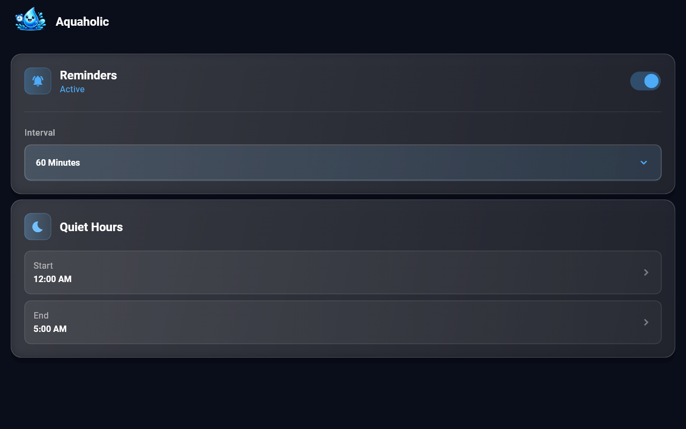
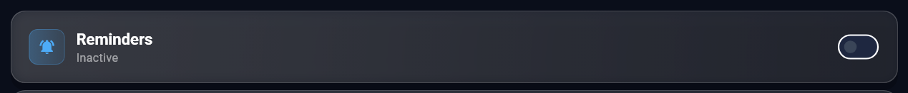
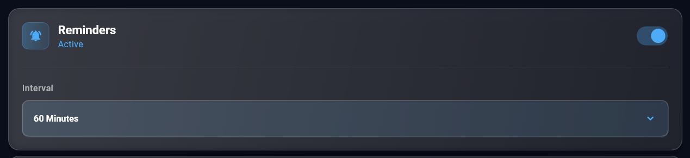
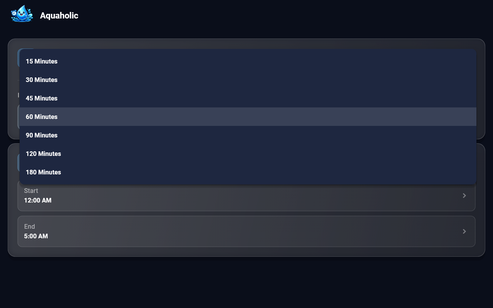
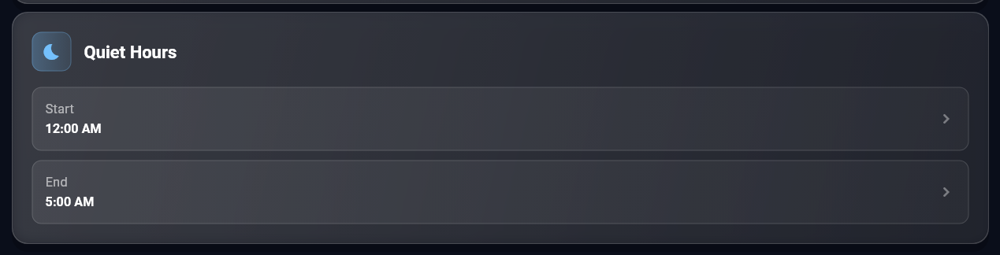
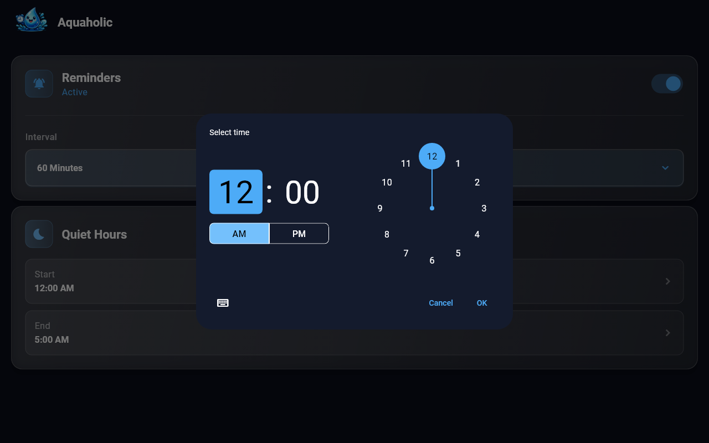

# Aquaholic

Aquaholic is the simplest water reminder app you'll ever use. No accounts, no complicated
tracking, no guilt trips — just gentle local notifications to drink water at intervals that
work for you.

Built with Flutter, it runs on Android, iOS, macOS and Windows from a single codebase
(`lib/main.dart`, ~740 lines).



## Key features

- **Pick your interval, forget about it.** One switch and a 15–180 minute interval; changes
  are saved and rescheduled instantly, with no Save button and no account.
- **Quiet hours that actually stay quiet.** Reminders inside your sleep window are skipped
  outright, including windows that wrap past midnight.
- **Offline and timezone-aware.** Everything runs on local notifications and
  `SharedPreferences` — no server, no network, and reminders stay correct across DST.

## Screens & sections

The app is a single page (`HomeScreen`) made of three sections, plus two overlays.

### Header

The app bar carries the logo asset and the app name — no navigation, because there is
nowhere else to go.


### Reminders card

The master switch. When off, the card collapses to a single row and no notifications are
scheduled.



Flipping it on reveals the interval selector and immediately schedules the next batch of
reminders.



Intervals are fixed choices: 15, 30, 45, 60, 90, 120 or 180 minutes.



### Quiet hours card

A start and an end time; reminders that would land inside this window are skipped. Both
rows open the standard Material time picker.





Every change is saved and rescheduled on the spot — there is no Save button. While that
happens, a thin `LinearProgressIndicator` appears under the cards and the controls are
disabled.

## How it works

1. `main()` boots `AquaholicApp`, a dark Material 3 app whose only route is `HomeScreen`.
2. `HomeScreen.initState` calls `_load()`, which initializes `_NotificationService`, reads
   the saved `ReminderSettings`, and — if reminders are enabled — schedules them.
3. Any UI change goes through `_apply()`: it writes settings to `SharedPreferences`, then
   cancels and re-schedules the notification batch.

### Scheduling model

There is no repeating-alarm API that respects quiet hours across every platform, so the app
schedules a rolling batch of one-off notifications instead:

- `_computeNextTimes()` walks forward from now in `intervalMinutes` steps and collects the
  first 60 timestamps that fall outside quiet hours (with a guard of `60 * 10` iterations so
  an interval swallowed entirely by quiet hours can't loop forever).
- Each timestamp is registered with `zonedSchedule` under id `1000 + i`, using
  `AndroidScheduleMode.inexactAllowWhileIdle` so Android doesn't need exact-alarm permission.
- `cancelAllScheduled()` clears ids 1000–1059 before every reschedule, so re-applying
  settings never leaves stale reminders behind.

At a 60 minute interval, 60 scheduled notifications cover roughly 2.5 days; the batch is
refreshed every time the app is opened or a setting changes.

### Quiet hours

`_isWithinQuietHours()` compares minutes-since-midnight. A window that wraps past midnight
(start 22:00, end 07:00) is handled by the `start > end` branch; start == end means "no
quiet hours" rather than "silent all day".

### Time zones

`timezone` is initialized with the device zone reported by `flutter_timezone`, so reminders
stay correct across DST. If the plugin is unavailable (missing platform implementation or a
platform exception), the app falls back to UTC instead of failing to start.

### Permissions

Requested on first launch, per platform: iOS/macOS ask for alert, badge and sound; Android
13+ asks for the notifications permission. Windows uses `flutter_local_notifications_windows`
and needs no runtime prompt.

## Persisted settings

Stored via `SharedPreferences` (`_SettingsStore`):

| Key                 | Type | Default         | Meaning                                               |
| ------------------- | ---- | --------------- | ----------------------------------------------------- |
| `enabled`           | bool | `false`         | Master reminder switch                                |
| `intervalMinutes`   | int  | `60`            | Minutes between reminders, clamped to 15…1440 on load |
| `quietStartMinutes` | int  | `0` (12:00 AM)  | Quiet window start, minutes since midnight            |
| `quietEndMinutes`   | int  | `300` (5:00 AM) | Quiet window end, minutes since midnight              |

## Quick start

```bash
flutter pub get
flutter run            # or: flutter run -d windows / -d macos
```

Requires Flutter with Dart SDK ^3.5.4.

## Screenshots

Regenerate the images in `screenshots/` after a UI change:

```bash
flutter test tool/capture_screenshots.dart
```

`tool/capture_screenshots.dart` renders the real widget tree on a 1280×800 surface, loads
Roboto and MaterialIcons from the Flutter SDK (otherwise `flutter_test` draws text as boxes),
stubs the notification/timezone plugin channels, and writes one PNG per state and per
section. Add a screenshot by adding a `testWidgets` block with a `_shoot(...)` call — pass a
`section:` finder to crop to a single card.

## Project layout

```
lib/main.dart                  entire app: theme, settings, notifications, UI
assets/                        logo (app bar + icons)
tool/capture_screenshots.dart  screenshot generator
screenshots/                   generated PNGs used by this README
test/widget_test.dart          smoke test
```

## Dependencies

`flutter_local_notifications`, `flutter_local_notifications_windows`, `timezone`,
`flutter_timezone`, `shared_preferences`.

## Notes & limits

- Minimum interval is 15 minutes; anything smaller is clamped.
- Reminders are scheduled in batches of 60, not as an infinite repeat — the app must be
  opened occasionally to top the batch back up.
- Notification text is fixed ("Drink water" / "Time to hydrate") and there is no intake
  logging or history; that is the point.
